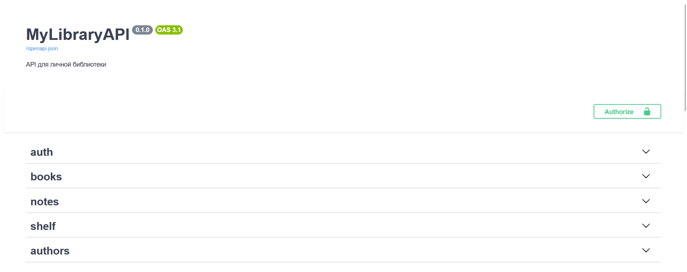

# MyLibraryAPI

REST API для управления личной библиотекой: каталог книг, авторов, персональная полка с рейтингами и статусами чтения, заметки к книгам.

> Pet-проект для практического освоения FastAPI, async SQLAlchemy и архитектурных паттернов backend-разработки. 




## Быстрый старт

### Требования

Docker и Docker Compose.

### Запуск

1. Склонируй репозиторий:
    ```bash
    git clone https://github.com/Saukovich/MyLibraryAPI.git
    ```

2. Скопируй содержимое `.env.example` в `.env` и заполни переменные (минимум `SECRET_KEY`):
    ```bash
    cp .env.example .env
    ```
   
3. Запусти:
    ```bash
    docker compose up --build
    ```

4. API будет доступен на `http://localhost:8000`, а интерактивная документация на `http://localhost:8000/docs` (интерактивная документация будет недоступна, если в `.env` `DEBUG="False"`).

## Стек

**Backend:** Python 3.11, FastAPI, SQLAlchemy 2.0 (async), PostgreSQL, Pydantic v2, PyJWT.

**Инфраструктура:** Docker, Docker Compose, Alembic.

**Тестирование:** Pytest, pytest-asyncio, httpx.

**Качество кода:** Black, Flake8, isort, pre-commit.

## Возможности

- **Книги и авторы:** CRUD, фильтрация по названию / автору / году и т.д., топ популярных книг;
- **Полка пользователя:** добавление книг, статусы чтения, рейтинги книг, статистика;
- **Заметки:** привязаны к конкретной книге на полке пользователя;
- **Аутентификация:** регистрация, вход по JWT, разграничение доступа между пользователями.

## Архитектура

Проект построен по слоистой архитектуре:

```
routres/        — HTTP-слой
services/       — Бизнес-логика
repositories/   — Доступ к данным, SQL-запросы
models/         — SQLAlchemy ORM-модели
schemas/        — Pydantic-схемы валидации запросов / ответов
```

Каждый слой знает только о том, что лежит ниже него. Репозитории не знают об HTTP, сервисы не знают об деталях SQL-запросов.

## Тестирование

Запуск тестов:

```bash
pytest
```

Покрытие по слоям:

- Репозитории — на реальной тестовой БД (in-memory SQLite);
- Сервисы — бизнес-логика и обработка ошибок;
- Роутеры — end-to-end через AsyncClient;
- Дополнительные тесты для Pydantic-схем на проверку собственных валидаций.

## Локальная разработка без Docker

1. `python -m venv .venv && venv/bin/activate`
2. `pip install -r requirements.txt`
3. `.env` с `DATABASE_URL=sqlite+aiosqlite:///mylibrary.db`
4. `alembic upgrade head`
5. `uvicorn app.main:app --reload`

## Дальнейшие планы

- [ ] Refresh-токены
- [ ] Новые поля у книг (обложка, жанры, количество страниц, издательство, ISBN, описание и т.д.)
- [ ] Возможность создавать теги для книг и коллекции
- [ ] Возможность делиться полками

## Лицензия

MIT